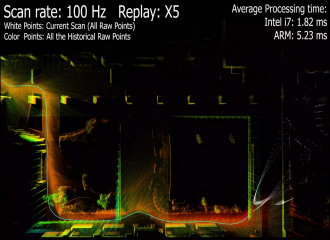
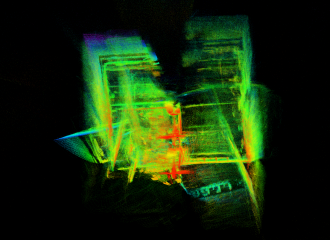
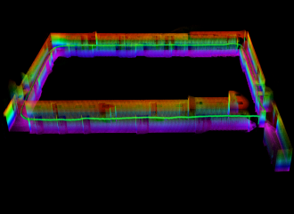

# Robocon MID-360 Autonomy Stack

**Simulation-first ROS 2 autonomy for competition robots**

Robocon MID-360 Autonomy Stack is a modular research and engineering platform for LiDAR-driven mobile robotics. It connects Gazebo sensor simulation, Livox `CustomMsg` transport, FAST-LIO2 mapping, fixed-map localization, perception gating, pose-command arbitration, and safety-aware competition control in one reproducible ROS 2 workspace.

<p align="center">
  <a href="https://github.com/yubohann/Robocon-mid360-autonomy-stack/actions/workflows/ci.yml"></a>
  <a href="https://github.com/yubohann/Robocon-mid360-autonomy-stack/blob/main/LICENSE"></a>
  <a href="https://github.com/yubohann/Robocon-mid360-autonomy-stack"></a>
  <a href="https://yubohann.github.io/Robocon-mid360-autonomy-stack/"></a>
</p>

## System Overview

```text
Gazebo / Livox simulation
          |
          v
Livox CustomMsg + IMU  -->  FAST-LIO2  -->  local odometry
                                      |
                                      v
                         registered cloud mapper
                                      |
                         frozen PCD + metadata
                                      |
                                      v
                       scan-to-map localization
                                      |
                                      v
             perception gate --> action arbitration --> competition supervisor
```

The public TF contract is:

```text
map -> odom -> base_link -> imu_link -> lidar_mid360
```

Each boundary is explicit, testable, and replaceable. Simulation adapters provide deterministic inputs while the control layer keeps localization freshness, map lock, perception validity, action feedback, heartbeat, expiry, cancellation, and recovery as first-class state.

## Capabilities

- **MID-360 data path**: Livox `CustomMsg`, per-point timing, IMU transport, input validation, and freshness diagnostics.
- **FAST-LIO2 integration**: ROS 2 launch profiles for mapping and local odometry with controlled motion scripts.
- **Fixed-map localization**: PCD loading, map metadata, scan matching, `map -> odom` anchoring, tracking states, and recovery transitions.
- **Competition control**: rule-aware supervisor, versioned action requests, perception gates, protocol handling, and fault-injection tests.
- **Gazebo environments**: candidate indoor competition scene, open-field degradation scene, field geometry, robot model, hoops, and simulated MID-360 sensor.
- **Reproducible experiments**: one-command dispatchers, manifests, deterministic ROS domain isolation, metrics exporters, and publication-ready plotting tools.
- **Public portfolio**: a lightweight GitHub Pages site presents the architecture and selected simulation evidence without exposing private run archives.

## Repository Layout

```text
src/
  mid360_localization_contract/  Input, frame, tracking, and map contracts
  mid360_map_localizer/          Fixed-map scan matcher
  mid360_map_tools/              Registered-cloud mapper and occupancy tools
  robocon_game_supervisor/       Competition state machine and safety gates
  robocon_perception_adapter/    Target validity and perception interface
  robocon_camera_yolo_adapter/   Detector boundary and metric evaluator
  robocon_pose_command_bridge/   Pose-to-command arbitration boundary
  robocon_mid360_simulation/     Gazebo worlds, robot, sensor, and runners
  vendor_fast_lio/               FAST-LIO2 source and license notice
  vendor_livox_ros_driver2/      Livox ROS 2 driver and license notice
tools/                            Validation, replay, metrics, and plotting utilities
site/                             GitHub Pages portfolio site
.github/workflows/                Continuous integration and Pages deployment
```

Private run archives, generated maps, bags, internal audits, and development notebooks are intentionally kept outside the public source tree and are ignored by Git.

## Quick Start

The supported development environment is Ubuntu 22.04 with ROS 2 Humble. From WSL or a native Ubuntu shell:

```bash
source /opt/ros/humble/setup.bash
cd /path/to/Robocon-mid360-autonomy-stack

export LIVOX_SDK2_ROOT=/path/to/Livox-SDK2/install
colcon build --symlink-install --cmake-args -DLIVOX_SDK2_ROOT="$LIVOX_SDK2_ROOT"
source install/setup.bash
```

Inspect launch arguments and run the dependency-light validation suite:

```bash
ros2 launch robocon_mid360_simulation gazebo_mid360_lio.launch.py --show-args
python3 tools/validate_project.py
python3 -m unittest discover -s src -p 'test_*.py' -v
```

Run the bounded experiment groups from one command:

```bash
bash tools/run_experiments.sh --dry-run all
bash tools/run_experiments.sh quality
bash tools/run_experiments.sh faults
bash tools/run_experiments.sh rgbd
```

For a visible Gazebo and RViz session:

```bash
bash tools/run_experiments.sh gui
```

The dispatcher creates an isolated run directory, records the exact command and ROS domain, and keeps generated evidence outside the public source files.

## Simulation Profiles

| Profile | Purpose |
| --- | --- |
| `30000-ray` | Full-density Gazebo sensor profile for controlled mapping and LIO experiments |
| `2000-ray` | Fast topic and interface smoke profile |
| `indoor_competition_candidate` | Structured indoor scene with field geometry and four hoop assets |
| `open_field_degraded` | Quality-gating and geometric-degradation tests |
| `gazebo_simulation` | Evidence label for local simulation results |
| `bag_replay` | Evidence label for replayed recorded inputs |

## Visual Snapshot

The following views are curated Gazebo simulation evidence from the public portfolio set.

<p align="center">
  
  
</p>
<p align="center">
  
</p>

<p align="center"><em>Scan timing, indoor reconstruction, and competition-field geometry.</em></p>

## Verification

The CI workflow runs Python contract tests, validates ROS package manifests, installs ROS dependencies, builds the interface and control packages, and executes the ROS test suite. Local runs can use the same commands:

```bash
colcon test --event-handlers console_direct+
colcon test-result --verbose
```

Additional tools export run summaries and figures from retained JSON/CSV data:

```bash
python3 tools/export_run_metrics.py <run-directory> <output-directory>
python3 tools/plot_run_metrics.py <metrics.csv> <output-directory>
```

## Attribution

Third-party components remain in their source boundaries with their original license files and notices. Adapted packages include an `UPSTREAM_NOTICE.md` describing the source repository, revision, and scope of changes. See the notices under `src/` before redistributing a modified build.

## Portfolio

Explore the visual project overview at:

**https://yubohann.github.io/Robocon-mid360-autonomy-stack/**

The site highlights the architecture and selected Gazebo simulation evidence from the three curated images in `site/assets/`.

## License

Team-owned files are released under the repository license in [`LICENSE`](LICENSE). Vendored components retain their own licenses and notices.
